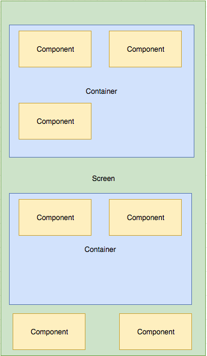

# Xapo Frontend test

## Getting started
**NOTE:** To run the application you must create a new .env file with your `username` and `password` from Github. You can see an example of the file in `.env.template`

Install dependencies with yarn (or npm):
```
yarn
```

Start the bundler:
```
yarn start
```

Run tests
```
yarn test
```

Run storybook
```
yarn storybook
```

## Dependencies:
- Internationalization: i18n-js
- State management: react-redux (reduxsauce)
- Styles: styled-components
- Navigation: react-router
- Functional programming: ramda
- Testing: Jest, Enzyme.


## Directory Structure
- assets: Static files, localization files are located here.
- components: General purpose components have their home here.
- containers: Components that use other components go here.
- screens: This directory holds Components that serve as Screens.
- store: All global state management are located here.


## NOTES
- **Why the application sort the repositories by stars instead of by watchers?**

  The application is using the latest version of the Github API (GraphQL - version 4) to get all of the repositories from facebook. As we can see in [documentation](https://developer.github.com/v4/enum/repositoryorderfield/) of the API it is not possible to sort by watchers. Due to the data is paginated with a limit of 100 items per request I decided to sort the repositories by stars.

- **Why is the application using two versions of the Github API to get the contributors?**

  Because this feature is not yet developed in the new version of the API. [Info](https://platform.github.community/t/contributors-of-a-repository/3680/2)

- **Why the application needs Github username and password?**

  Because version 4 of the Github API need authentication

- **Why application uses [reduxsauce](https://github.com/infinitered/reduxsauce)?**

- This application also have a mobile version, try it in your mobile phone :)

  Creating Reducers and Actions on Redux sometimes made complicated because of too large switch statements for a single reducer, reduxsauce is here to save the day. It comes with too many magic and simplicity for your redux needs! even it comes with resettable reducer option. Reduxsauce just need one file to handle Actions for a Reducer and the Reducer itself, with minimum lines of code that also readable.

## Component structure

